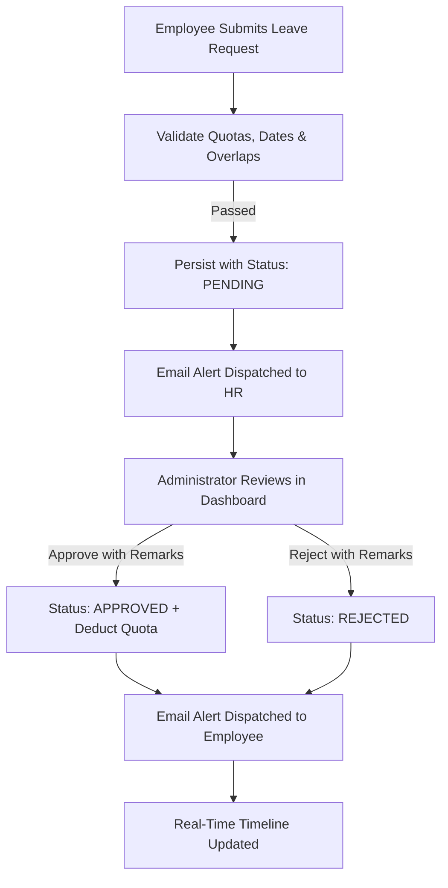

# 🏢 Enterprise Employee Leave Management System

A production-grade, enterprise backend and interactive web application built with **Java 17/21/24**, **Spring Boot 3**, **Spring Data JPA**, **Hibernate**, and **MySQL / H2 Database**, complete with **Leave Balance & Quota Tracking**, **Simulated Email Notifications**, **CSV Export**, **Department Analytics**, **Swagger OpenAPI 3** documentation, and comprehensive automated test suites.


---

## 📖 1. Project Overview & Features

The **Enterprise Employee Leave Management System** automates the corporate leave application and approval lifecycle with real-world enterprise requirements:

1. **Leave Types & Quota Tracking**:
   - Categorized leave types: `CASUAL`, `SICK`, `ANNUAL`, `EMERGENCY`.
   - Live quota balance validation before submission (e.g. 12 Casual, 10 Sick, 15 Annual days).
   - Automatic deduction on supervisor approval and restitution if cancelled/rejected.
2. **Manager Remarks & Decision Workflow**:
   - Managers can attach structured feedback/remarks during approval or rejection.
3. **Simulated Email Notification Service**:
   - Audit trail and email dispatch simulation to employees and managers upon leave submission, approval, and rejection.
4. **HR CSV Export**:
   - One-click export endpoint `/api/leaves/export` downloading all leave records formatted for HR reporting and spreadsheets.
5. **Department & Leave Analytics**:
   - Aggregated leave metrics `/api/leaves/analytics` calculating organization-wide approval rates, department distributions, and leave type usage.



---

## 🏗️ 2. Layered Architecture

The application follows strict layered software architecture:

```
                      Client (Browser Web UI / Postman / Swagger)
                                          │
                                          ▼
                      Controller Layer (@RestController)
                        ├── EmployeeController (/api/employees)
                        ├── LeaveRequestController (/api/leaves)
                        └── NotificationController (/api/notifications)
                                          │
                                          ▼
                      Service Layer (Business Logic & Validation)
                        ├── EmployeeServiceImpl
                        ├── LeaveRequestServiceImpl
                        └── NotificationServiceImpl
                                          │
                                          ▼
                      Repository Layer (Spring Data JPA)
                        ├── EmployeeRepository
                        ├── LeaveRequestRepository
                        └── NotificationRepository
                                          │
                                          ▼
                      Entity Layer (Hibernate / JPA ORM)
                        ├── Employee (@Table(name = "employees"))
                        ├── LeaveRequest (@Table(name = "leave_requests"))
                        ├── Notification (@Table(name = "notifications"))
                        ├── LeaveType (Enum: CASUAL, SICK, ANNUAL, EMERGENCY)
                        └── LeaveStatus (Enum: PENDING, APPROVED, REJECTED)
                                          │
                                          ▼
                      Database (MySQL / H2 In-Memory)
```

---

## 🚀 3. Quick Start & Execution

### Prerequisites
- **Java**: JDK 17, 21, or 24 installed (for Option A & B)
- **Docker**: Installed and running (for Option C)
- **Port**: 8080 (and optionally 3306) available

### Option A: 1-Click Launch (Windows)
Double-click `run.bat` or execute in PowerShell:
```powershell
.\run.bat
```

### Option B: Using Maven Wrapper
```powershell
.\mvnw.cmd spring-boot:run
```

### Option C: Docker Container Setup (Recommended for Production/MySQL)
Spins up both the Spring Boot backend and the MySQL database container preconfigured with a healthcheck:
```bash
docker compose up --build -d
```
To stop the services:
```bash
docker compose down
```

### 🌐 Access URLs
| Component | URL | Description |
| :--- | :--- | :--- |
| **Interactive Web Dashboard** | [http://localhost:8080/](http://localhost:8080/) | Live responsive Single Page Application |
| **Swagger OpenAPI 3 Sandbox** | [http://localhost:8080/swagger-ui.html](http://localhost:8080/swagger-ui.html) | Interactive API sandbox and test docs |
| **H2 Web Console** (Dev only) | [http://localhost:8080/h2-console](http://localhost:8080/h2-console) | JDBC URL: `jdbc:h2:mem:employee_leave_db`, User: `sa`, Password: *(blank)* |

---

## 📡 4. REST API Endpoint Reference

### Employee APIs (`/api/employees`)
| Method | Endpoint | Description |
| :--- | :--- | :--- |
| `POST` | `/api/employees` | Create employee with default quotas (Casual: 12, Sick: 10, Annual: 15) |
| `GET` | `/api/employees` | Get all employees (optional filter `?department=IT`) |
| `GET` | `/api/employees/{id}` | Get employee details & balances by ID |
| `PUT` | `/api/employees/{id}` | Update employee profile |
| `DELETE` | `/api/employees/{id}` | Delete employee & cascade delete leave requests |

### Leave APIs (`/api/leaves`)
| Method | Endpoint | Description |
| :--- | :--- | :--- |
| `POST` | `/api/leaves/employee/{id}` | Submit leave request with leave type & quota check |
| `GET` | `/api/leaves` | Get all leaves across company (optional `?status=PENDING`) |
| `GET` | `/api/leaves/pending` | Get all pending leaves for admin review |
| `GET` | `/api/leaves/employee/{id}` | Get specific employee's leave history & remarks |
| `PATCH` | `/api/leaves/{id}/status` | Approve/reject leave with optional `&remarks=...` |
| `GET` | `/api/leaves/analytics` | Company-wide leave statistics and distribution |
| `GET` | `/api/leaves/export` | Download complete leave audit report in CSV format |
| `DELETE` | `/api/leaves/{id}` | Delete a leave request (restores quota if approved) |

### Notification APIs (`/api/notifications`)
| Method | Endpoint | Description |
| :--- | :--- | :--- |
| `GET` | `/api/notifications` | Get latest 20 email activity and status alerts |
| `GET` | `/api/notifications/unread-count` | Get count of unread notification events |
| `PATCH` | `/api/notifications/{id}/read` | Mark a notification event as read |
| `POST` | `/api/notifications/mark-all-read` | Mark all notifications as read |

---

## 🧪 5. Automated Unit & Integration Tests

Run the complete test suite:
```powershell
.\mvnw.cmd clean test
```

### Included Test Suites:
- `EmployeeServiceTest`: Employee creation, email uniqueness, retrieval, and quota initialization.
- `LeaveRequestServiceTest`: Quota validation, balance deduction on approval, overlap checks, CSV generation, and analytics computation.
- `NotificationService`: Email simulation and unread tracking.
- `EmployeeControllerTest`: MockMvc HTTP integration tests for `/api/employees`.
- `LeaveRequestControllerTest`: MockMvc HTTP integration tests for `/api/leaves`, `/export`, and `/analytics`.
- `NotificationControllerTest`: MockMvc HTTP integration tests for `/api/notifications`.
- `EmployeeLeaveManagementApplicationTests`: ApplicationContext startup validation.

---
